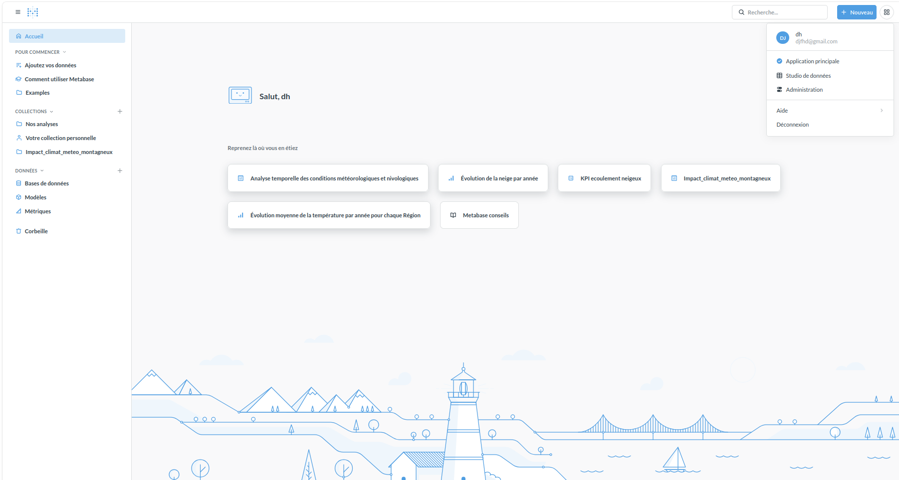
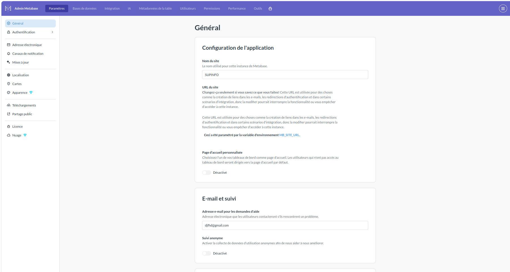
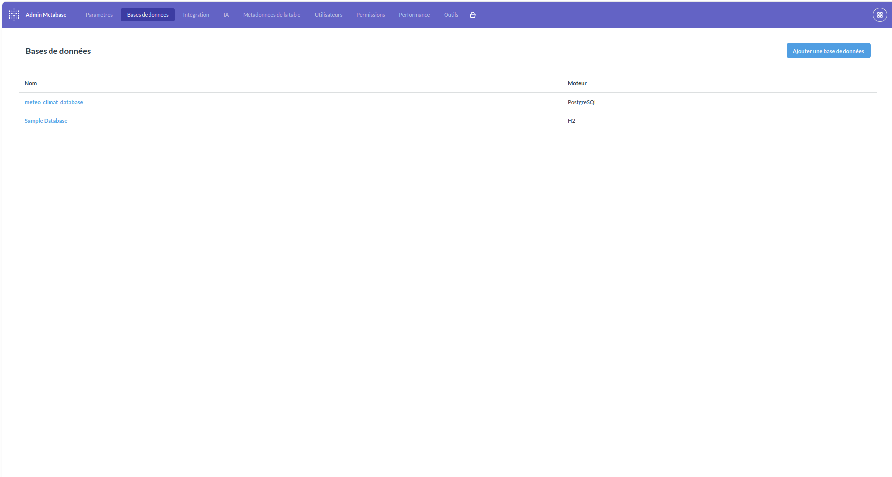
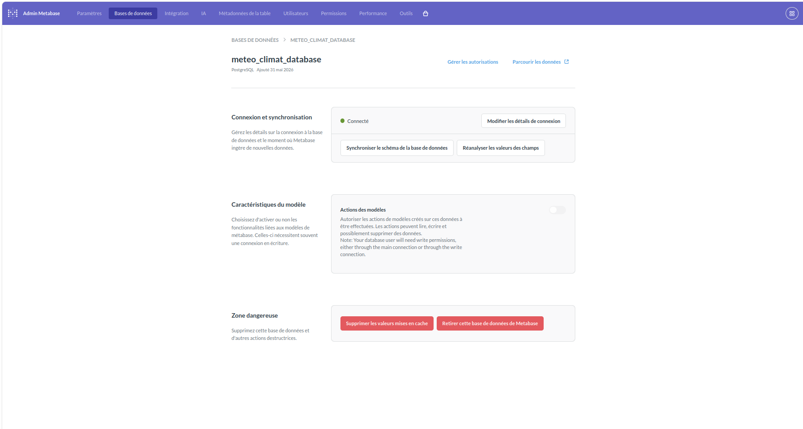

# 4DVST - Projet de visualisation des données météorologiques montagneuses et du changement climatique
## Auteur : Julien RENOULT - Mamadou-alpha DIALLO
## Promo : SUPINFO Programme Grande École 4ème année
### *Spécialité : Ingénierie Data*
### *Date : 27/05/2026 - 02/06/2026*
# Lien Projet : https://github.com/julien-data-analyst/4DVST-project

# Introduction

Dans le cadre du projet, nous devions construire une architecture data pour la collecte et l'analyse des voyages de taxis à New York City et la météo associée.

Pour présenter ce projet, nous allons d'abord vous présenter les technologies utilisées, ensuite les pré-requis pour pouvoir lancer l'architecture et pour finir ceux que nous avons faits pour chaque partie.

# Technologies utilisées  (Installation/Déploiement)

Pour mener à bien ce projet, plusieurs technologies ont dû être utilisées notamment :

- **python** : langage de programmation
- **dbt** : outil de transformation de données
- **PostgreSQL** : base de données permettant l'insertion et le traitement de JSON très simplement pour un gros volume de données
- **Docker** : technologie pour faciliter le déploiement de notre projet

# Comment lancer le projet

Pour lancer le projet, il vous suffit de cloner le repository et de lancer l'une des commandes suivantes à la racine du projet :

## Mode développement

```bash
docker-compose -f docker-compose.dev.yml up --build
```

Ce mode démarre les conteneurs pour PostgreSQL, dbt et Metabase. Après le démarrage, vous devrez exécuter manuellement les extractions et les modèles dbt dans les conteneurs concernés. Consultez les README des dossiers `extract-data/` et `dbt-dev/` pour les instructions détaillées.

## Mode production

```bash
docker-compose -f docker-compose.prod.yml up --build
```

Ce mode démarre le projet en configuration production.

## Accéder à Metabase

Après une initialisation complète, Metabase est accessible depuis :

http://localhost:3000/

Vous pourrez accéder aux différents dashboards dans deux collections :
- **Historique_meteo_montagne** : collection pour les dashboards liés à l'historique de la météo en montagne
- **Impact_climat_meteo_montagneux** : collection pour les dashboards liés à l'impact du changement climatique sur la météo en zone montagneuse

Si vous avez des soucis sur les visuels, nous vous demandons d'aller sur la page d'administration de Metabase :



Cliquer sur le bouton *Administration* et vous accéderez à cette page :



Cliquer ensuite sur *Base de données* en haut à gauche et vous accéderez à cette page :



Cliquer sur la base de données *meteo_climat_database* qui est la connexion à la base de données météorologique et climatique :



Enfin cliquer sur les deux boutons *Synchroniser le schéma de la base de données* et *Réanalyser les valeurs des champs*.

Cela devrait faire apparaître les modèles dans Metabase et les visuels devraient s'afficher correctement.


# Notes sur l'utilisation

- En mode développement, l'exécution complète du pipeline n'est pas automatisée : il faut lancer les extractions puis les modèles dbt manuellement.
- En mode production, l'objectif est de disposer d'un environnement plus proche d'un déploiement final.

# Dashboards Metabase

Le projet comprend deux dashboards principaux avec des axes d'analyse distincts :

- **Impact_climat_meteo_montagneux** : axe d'analyse pour observer l'impact du changement climatique sur la météo en zone montagneuse.
- **Historique_meteo** : historique de la météo en montagne.

# Branches créées

Pour pouvoir faire le projet, plusieurs branches ont été créées pour pouvoir faire les différentes parties du projet :
- `main` : branche principale du projet
- `feat(insertion-mensuel)/insert-with-dbt` : branche pour les extractions avec les deux scripts pythons concernés
- `feat(dbt-models)/create-processing-models` : branche pour la création des modèles dbt de traitement
- `feat(dbt-models)/create-analytics-models` : branche pour la création des modèles dbt d'analyse
- `feat(dashboards-meteo-climat)/create-save-dashboards` : branche pour la création et la sauvegarde des dashboards
- `feat(documentation-docker-compose-prod)/doc-docker-compose` : branche de développement pour les différentes fonctionnalités

# Syntaxe à respecter pour les branches et commits

- **Branches** : Les branches doivent être nommées de manière descriptive, par exemple `feature/ajout-nouvelle-fonctionnalite` ou `bugfix/correction-erreur-xyz`.
- **Commits** : Les messages de commit doivent indiquer si c'est un fix, feature ou autre, suivi d'une description concise du changement, par exemple `feat: ajout de la fonctionnalité de connexion` ou `fix: correction de l'erreur de validation des données`.

**Ne merger que si vous êtes sûr que votre code est fonctionnel et ne casse pas l'architecture.**

Quand est-ce que vous devez créer une branche ?
- Lorsque vous travaillez sur une nouvelle fonctionnalité (dashboard, dbt, etc. )
- Lorsque vous devez fixer un bug sur la branche main